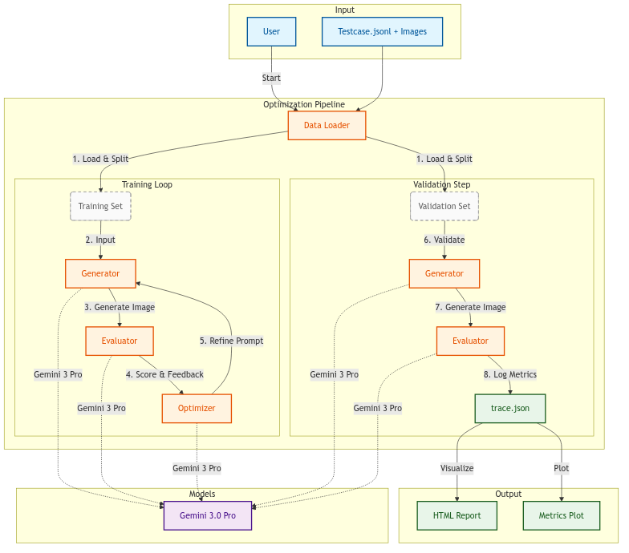
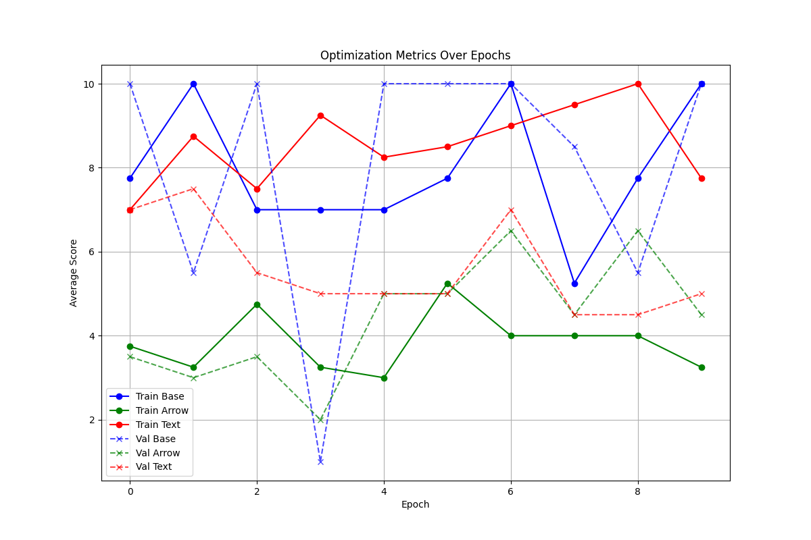

# Prompt Optimization App

This application optimizes prompts for generating annotated technical fashion sketches using Gemini 3.

## Setup

1.  **Install Dependencies**:
    ```bash
    uv add google-genai pillow pydantic python-dotenv
    ```

2.  **Environment**:
    Ensure you have access to `gemini-3.1-flash-image-preview` and `gemini-2.0-flash-001`.
    Set `GOOGLE_CLOUD_PROJECT` in your environment or `.env` file.

## Usage

Run the optimization loop:

```bash
python main_optimization.py
```

## Reporting

To generate a detailed HTML report of the optimization trace (including images, prompts, and reasoning):

```bash
uv run visualize_trace.py
```

This creates `trace_report.html`.

To generate a plot of the metrics over epochs:

```bash
uv run visualize_metrics.py
```

This creates `metrics_plot.png`.

## Components

-   `data_loader.py`: Loads and pairs images/annotations from `Testcase.jsonl`.
-   `generator.py`: Generates images using `gemini-3.1-flash-image-preview`.
-   `evaluator.py`: Evaluates generated images using `gemini-3.1-pro-preview` against a rubric.
-   `optimizer.py`: Proposes new prompts based on evaluation feedback using `gemini-3.1-pro-preview`.
-   `main_optimization.py`: Orchestrates the training loop (Generate -> Evaluate -> Optimize).
-   `check_status.py`: Checks the current status of the optimization run from `trace.json`.

## Project Structure

```text
├── macys_tek_pak/            # Data directory
│   ├── data/
│   │   ├── Images/           # Source images (EMP/REF pairs)
│   │   └── JSONL-Files/      # Annotation data
├── trace_assets/             # Generated images from optimization
├── check_status.py           # Status checker utility
├── data_loader.py            # Data management
├── evaluator.py              # LLM evaluator using gemini-3.1-pro-preview
├── generator.py              # Image generation using gemini-3.1-flash-image-preview
├── main_optimization.py      # Main training loop
├── optimizer.py              # Prompt optimization logic
├── trace.json                # Optimization history log
├── visualize_metrics.py      # Plotting utility
└── visualize_trace.py        # HTML report generator
```

## Architecture



## Results

The optimization process was recently configured to run for **30 epochs** with an **early stopping** mechanism (target score: 9.0 across all metrics).


### Latest Run (10 Epochs)
- **Final Epoch**: 9
- **Scores (Epoch 9)**:
    - **Training**: Base 10.0, Arrow 3.25, Text 7.75
    - **Validation**: Base 10.0, Arrow 4.5, Text 5.0

### Best Prompt (Epoch 9)

```text
You are an expert **Technical Fashion Illustrator** specializing in CAD overlays. Your task is to take a provided technical sketch and overlay specific red text and arrows onto it.

**INPUT DATA:**
- **Base Image:** A technical garment drawing. **Left Half = Front View**. **Right Half = Back View**.
- **Annotations:** {annotations}

**CRITICAL MANDATE: IMAGE PRESERVATION (NON-NEGOTIABLE)**
1.  **DO NOT REDRAW THE GARMENT.** The input image is the absolute ground truth. If the input shows a zipper, **keep the zipper** even if the text vaguely implies otherwise. Do not change lines, shading, or pixels of the garment itself.
2.  **OVERLAY ONLY:** Your output must be the **exact original image** with ONLY red text and red arrows added on top.
3.  **NO CROPPING:** Maintain the full canvas size.

**STEP-BY-STEP PLACEMENT LOGIC:**

**Step 1: Determine the View (Left vs Right)**
-   **RULE A (The "Inside" Rule):** Any item describing the **inside** of the neck (e.g., "Main Label", "Size Label", "Neck Tape", "Back Neck Tape") must go on the **FRONT VIEW (Left)**, pointing into the open neck.
-   **RULE B (The "Back" Rule):** Use the **BACK VIEW (Right)** *only* if the text contains explicit back-exterior terms: "Back Yoke", "Half Moon", "Back Dart", "Rear".
-   **RULE C (Default):** All other items (Sleeves, Hems, Pockets, Side Seams, Collars) go on the **FRONT VIEW (Left)**.

**Step 2: Determine the Feature (Visual Anchors)**
Scan the text for these keywords to decide where the arrow points:
1.  **"Sleeve" / "Cuff" / "Arm":** Point to the **Sleeve Hem** edge.
2.  **"Rib" / "Collar" / "FKR":** Point to the **Collar Band** (neck).
3.  **"Side" / "Vent" / \"Slit":** Point to the **Side Seam** near the bottom.
4.  **"Zipper" / "Placket":** Point to the center vertical opening.
5.  **"Straddle" / "Shoulder":** Point to the **Shoulder Seam** (slope).
6.  **"Bartack":** Point to a reinforcement spot (pocket corner or top of side slit).
7.  **Generic Default (e.g., "Coverstitch", "Bendback", "SNT"):**
    -   If text does *not* specify a location: Point to the **Bottom Hem**.

**Step 3: Render**
-   **Text:** Write the text **verbatim** (exact spelling) in RED in the nearest empty whitespace.
-   **Arrows:** Draw a thin **RED LINE** from the text to the exact feature edge determined in Step 2.
    -   *Crucial:* Do not cover key details of the sketch with the text itself.

**EXECUTION:**
1.  Load the Input Image. Treat it as a locked background.
2.  Iterate through the Annotation List. Apply Rules A/B/C and Visual Anchors.
3.  Draw the Red Overlay.
4.  Output the final Result.
```




See `trace.json` for detailed logs of each epoch, or open `trace_report.html` for a visual report.
